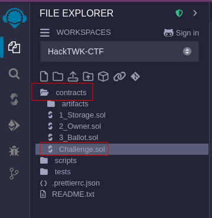

# Blockchain Solidity Challenge

# Agenda
Please verify the following Source Code for Secure Implementation.
There are two issues present in this Source Code. 
Can you find them all? You can use the official browser ide [remix](https://remix.ethereum.org/#lang=en&optimize=false&runs=200&evmVersion=null&version=soljson-v0.8.26+commit.8a97fa7a.js). 
-> Please navigate to the `contracts` Folder and select the `Challenge.sol` file.



## Questions
- [ ]  Which function is unsafe?
- [ ]  Which line needs some modification?
- [ ]  Should they be able to execute?
- [ ]  Which recipient should be entered instead? (consider the second flaw)

-> after you have answered all the questions correctly you will be granted the flag. Well done!

# Start the environment
## Build the Dockerfile
```bash
docker build -t flask-app .
```
## Run the Dockerfile
```bash
docker run -p 5000:5000 flask-app
```

## Source Code
```solidity
// SPDX-License-Identifier: MIT
pragma solidity ^0.8.0;

contract Crowdfunding {
    string public name;
    string public description;
    uint256 public goal; 
    uint256 public deadline;
    address public owner; //storing the blockchain address 

    //create a modifier
    modifier onlyOwner() {
        require(msg.sender == owner, "Not the Owner");
        _; //run the remainder of the mother function, else case
    }

    constructor (
        string memory _name,
        string memory _description,
        uint256 _goal,
        uint256 _durationInDays
    ) {
        name = _name;
        description = _description;
        goal = _goal;
        deadline = block.timestamp + (_durationInDays * 1 days);
        owner = msg.sender;
    }

    // this our funding function for users to adding money
    function fund() public payable {
        require(block.timestamp < deadline, "Crowdfunding has exceeded.");

    }

    // This function seems to be unsafe, but why?
    function withdraw() public onlyOwner {
        require(address(this).balance >= goal, "Goal has not been reached");
        uint256 balance = address(this).balance;
        require(balance > 0, "Please withdraw more than 0");

        payable(owner).transfer(balance);
    }

    function getContractBalance () public view returns (uint256) {
        return address(this).balance;
    }
}
```
