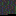

# lispyDev - Walkthrough

## guessing the password

Upon reading the text on Alex' page you will see some characters which are odd. These are called [thorn](https://de.wikipedia.org/wiki/%C3%9E) and are most commonly pronounced like the `th`. If you inspect the pages source code you will see comment which gives you a hint. `The password is the name of a programming language that sounds like my condition.` Focusing only on the last part `my condition` you can put together that Alex has a lisp as he seems to pronounce some `s` as `th`.

Alex also states that he/she enjoys `old, elegant languages` and that he/she particularly likes one that `have use of paranthesese`. One of the oldest languages still in use ist [Lisp](https://de.wikipedia.org/wiki/Lisp) developed in 1958. A "Hello World" program looks like this:

```lisp
(princ "Hello World!")
(terpri)
```

Putting these two pieces of information together the password is `lisp`

## logging in
The login page has an input for the password and a button with the text `public login`. When clicking this password an alert appears stating that the password was incorrect. It will do this every time you click it. Inspecting the source code you will find a hidden button which actually calles a function to perform the password check. You need to remove the attribute so you can click it or call the function manually.

## the secret space

The secret space contains three sub pages, but only the webterminal is of interest for now. Its a simple form that sends "commands" to the backend. Available are `help`, `list`, `cat` and `download`. Running `list` reveales that two files are present (`archive.txt` and `secret.png`). `secret.png` is the interesting one.



Each pixel encodes three ascii characters. One in each channel of RGB.

The information can be extracted from the image using a script like this:

```python
from PIL import Image
import sys

if len(sys.argv) < 2:
    print("no path given")
    exit()

img = Image.open(sys.argv[1])

pixels = img.load()

txt = ""

for y in range(img.size[1]):
    for x in range(img.size[0]):
        txt += chr(pixels[x, y][0]) # r
        txt += chr(pixels[x, y][1]) # g
        txt += chr(pixels[x, y][2]) # b
        pass
    pass

print(txt)
```

Result:
```
-1[1-3>1+1<1]1>1-2.1-12.1-1.1[1-2>1+3<1]1>1+1.1-9.1+1[1-2>1+1<1]1>1.1>1-1[1-3>1+1<1]1>1-3.1+6.1-5.1>1-1[1-5>1+1<1]1>1.1-2[1-3>1+2<1]1>1-2.1+1[1-3>1+2<1]1>1-1.1+1.1-7.1+1[1-3>1+2<1]1>1+1.1+3[1-1>1+2<1]1>1+1.1-15.1-1[1-5>1+1<1]1>1-1.1[1-1>1+5<1]1>1-2.1>1-2[1-5>1+1<1]1>1.1>1-1[1-3>1+1<1]1>1-4.1+1[1-2>1+3<1]1>1-1.1+1[1-3>1+2<1]1>1-1.1-1[1-2>1+3<1]1>1.1[1-1>1+5<1]1>1+1.1>1-1[1-5>1+1<1]1>1.1>1-1[1-3>1+1<1]1>1.1-2[1-5>1+1<1]1>1+1.1-1[1-1>1+3<1]1>1-1.1>1-1[1-3>1+1<1]1>1-1.1+2.1>1-2[1-5>1+1<1]1>1.1+2[1-4>1+3<1]1>1-1.1+7.1+2.1>1-2[1-5>1+1<1]1>1.1>1-1[1-3>1+1<1]1>1-3.1-2[1-3>1+1<1]1>1-2.1>1+1[1-3>1+2<1]1>1.1[1-3>1+1<1]1>1+3.1[1-1>1+5<1]1>1.1>1+1[1-3>1+2<1]1>1+2.1[1-2>1+1<1]1>1+4.1+1[1-5>1+1<1]1>1.1
```

This is run length encoded [Brainfuck](https://de.wikipedia.org/wiki/Brainfuck)-code, which can be decoded f.ex. like this:

```js
const fs = require("fs");

const content = fs.readFileSync("msg.txt").toString();

let result = "";
let bufNum = "";
let chr = "";

for (let i = 0; i < content.length; i++) {
    const chrAt = content[i];

    if (chrAt.match("[0-9]")) {
        bufNum.push(chrAt);
        continue;
    }
    if (chr !== "") {
        result += chr.repeat(parseInt(bufNum.join("")))
    }
    chr = chrAt;
    bufNum = [];
}

fs.writeFileSync("out.txt", result.replace(/[^+\-.<>\[\]]/g, ""));
```

Which results in:
```brainfuck
-[--->+<]>--.------------.-.[-->+++<]>+.---------.+[-->+<]>.>-[--->+<]>---.++++++.-----.>-[----->+<]>.--[--->++<]>--.+[--->++<]>-.+.-------.+[--->++<]>+.+++[->++<]>+.---------------.-[----->+<]>-.[->+++++<]>--.>--[----->+<]>.>-[--->+<]>----.+[-->+++<]>-.+[--->++<]>-.-[-->+++<]>.[->+++++<]>+.>-[----->+<]>.>-[--->+<]>.--[----->+<]>+.-[->+++<]>-.>-[--->+<]>-.++.>--[----->+<]>.++[---->+++<]>-.+++++++.++.>--[----->+<]>.>-[--->+<]>---.--[--->+<]>--.>+[--->++<]>.[--->+<]>+++.[->+++++<]>.>+[--->++<]>++.[-->+<]>++++.+[----->+<]>.
```

Executing this code using a brainfuck interpreter like [https://gc.de/gc/brainfuck/](https://gc.de/gc/brainfuck/) results in: `SGFja1RXS3tMNG1iZDRfQzQxY3UxdTVfMTVfRnVuIX0=`

This is base64 encoded for `HackTWK{L4mbd4_C41cu1u5_15_Fun!}` which is the flag and can be validated using the `validate flag` subpage in the secret space.
