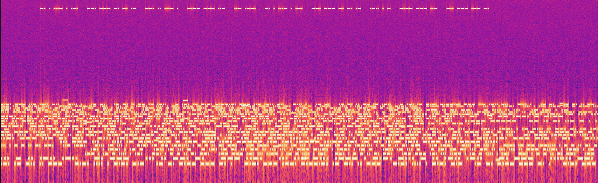
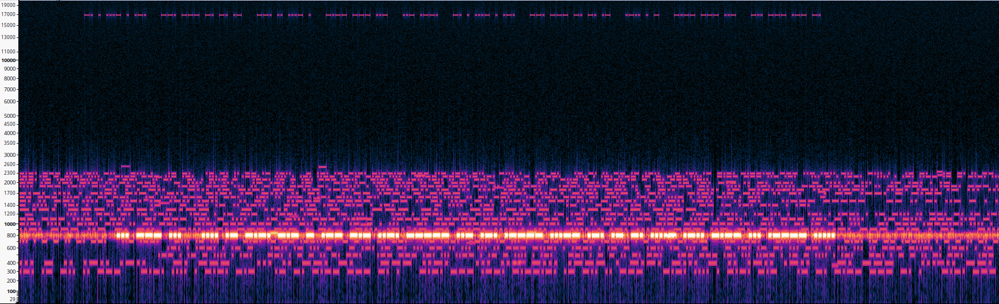

# Lost Hiker - Walkthrough

When looking at the recording as a spectrum in f.ex. audacity it looks like this:


The message at 800 Hz starts with `... --- ...` or `sos`  in morsecode indicating the hiker is sending on that frequency.

Isolating it gives this spectrum:



The extracted morsecode looks like this:
```
... --- ... .... .- -.-. -.- - .-- -.- ..-. ----- ..- .-. .---- ...-- .-. .- -. ....- .-.. -.-- ... .---- .....
```

which translates to: `SOSHACKTWKF0UR13RAN4LYS15`, omitting the `SOS` the flag is `HACKTWKF0UR13RAN4LYS15`
