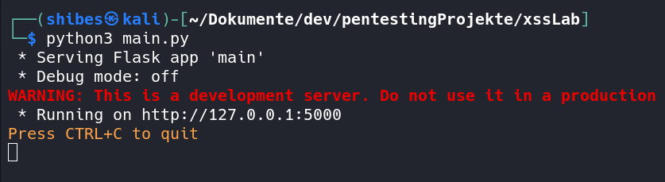
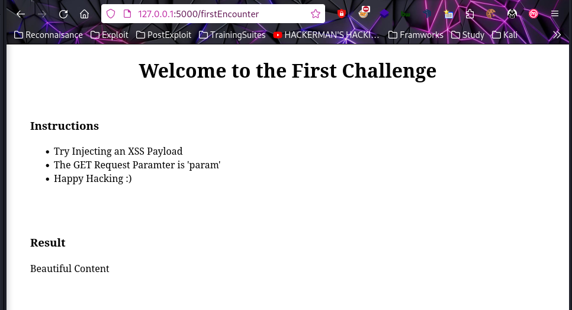

# XSS LAB

Welcome to XSS Lab! 
A fun little Website with pages which are purposely vulnerable to XSS.
The Backend component is written with the Python Flask Framework and does only function as light weight server aka infrastrutural backbone.

Keep in that this Application is vulnerable so don't put this into a public network.
However, this application purpose is educational.
!Please keep save and don't harm others!

I want to thank pwnfunction for the inspiration.

## Quickstart

