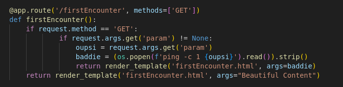

# Command Injection Challenge



# Preparation
First, please install poetry, navigate to the project folder and install the required dependencies using the following commands.

```bash
sudo apt install poetry -y
cd commandInjection && poetry install
```

# Starting the Challenge
Next, dtart the application using the following command.
Now navigate to http://localhost:5000

```bash
poetry run python main.py
```