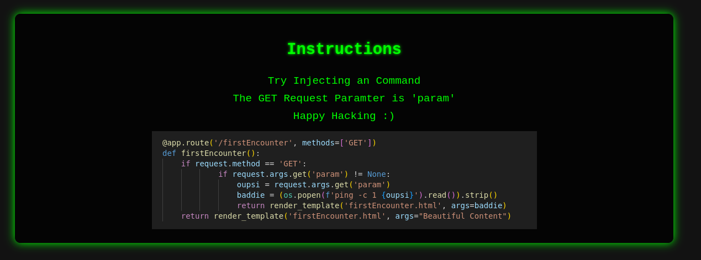

# Command Injection Challenge



# Starting the Application (using Docker)
## Create Docker Image
```bash
sudo docker build -t commandinjectionlab .
```

## Starting the Application
```bash
sudo docker run --rm -it -p 8080:5000 -v ./.env:/commandInjectionLab/.env --name commandinjectionlab-container commandinjectionlab
```